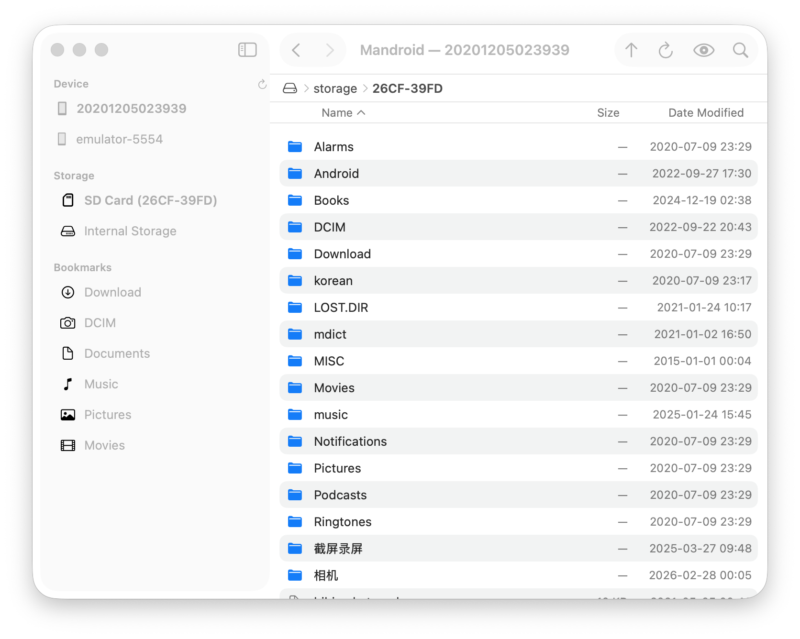

# Mandroid Transfer

A native macOS file manager for Android devices over ADB. Browse, transfer, and organize files on your Android phone or tablet directly from your Mac.



## Features

- **File browsing** -- Navigate your Android device's file system with a familiar Finder-like interface
- **Drag and drop** -- Transfer files between your Mac and Android device by dragging and dropping
- **Multiple devices** -- Connect and switch between multiple Android devices or emulators
- **Storage volumes** -- Access internal storage and SD cards
- **Bookmarks** -- Quick access to common folders (Download, DCIM, Documents, Music, Pictures, Movies) with support for custom bookmarks
- **File operations** -- Create folders, delete files, and manage your device storage
- **Search** -- Filter files in the current directory with Cmd+F
- **Sort** -- Sort by name, size, or date modified

## Requirements

- macOS 14+
- [ADB](https://developer.android.com/tools/adb) (Android Debug Bridge) installed
- Android device connected via USB with USB debugging enabled

## Build

```bash
swift build
```

To create a release build:

```bash
./Scripts/build_release.sh
```

## License

MIT
